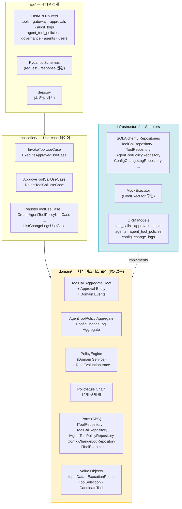
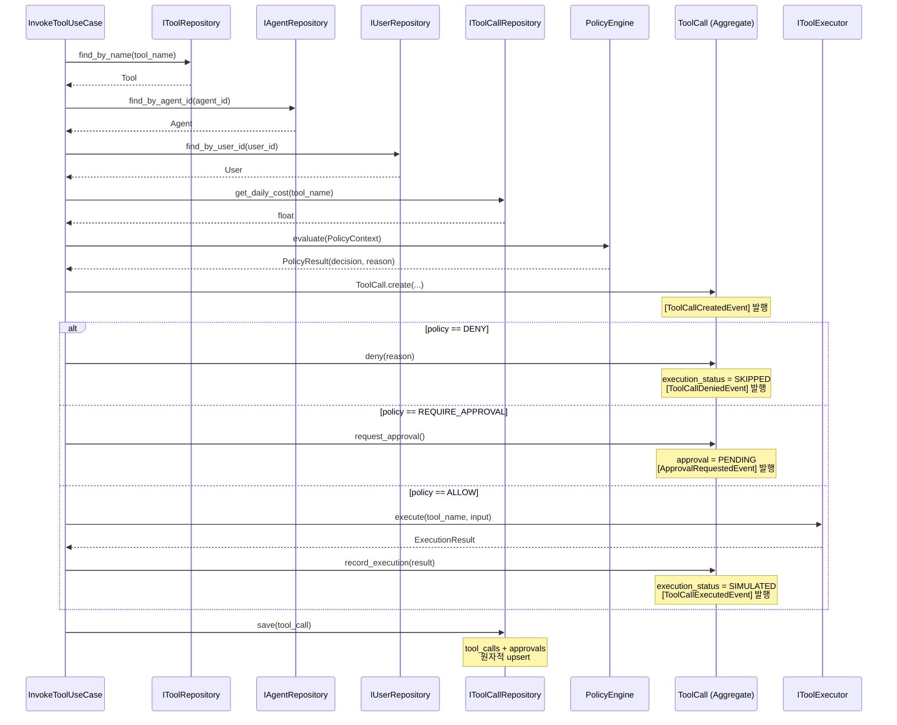
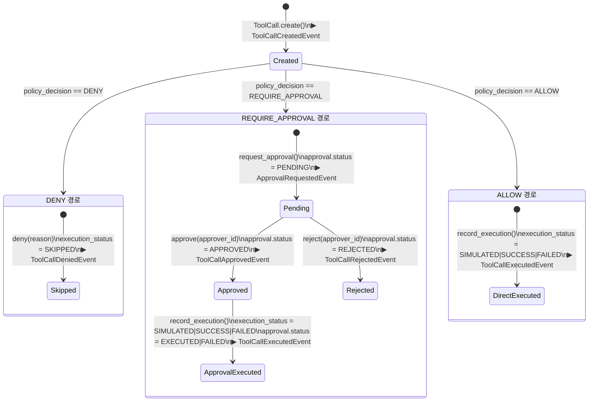
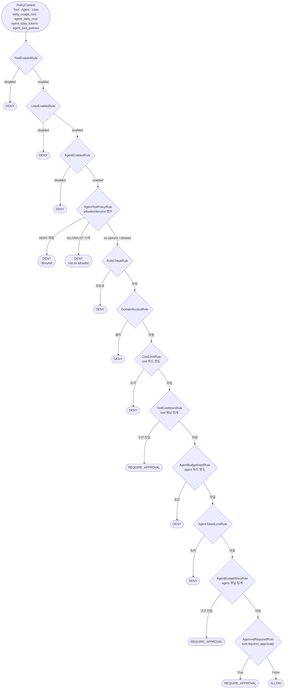
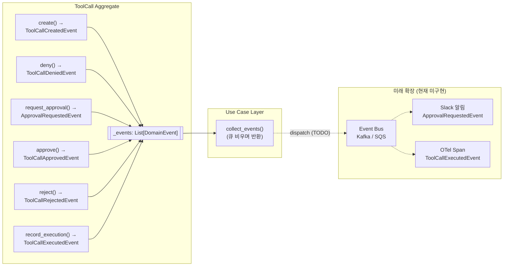
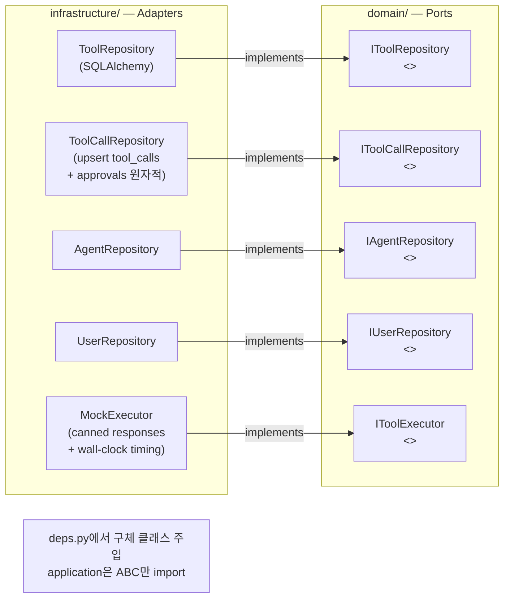
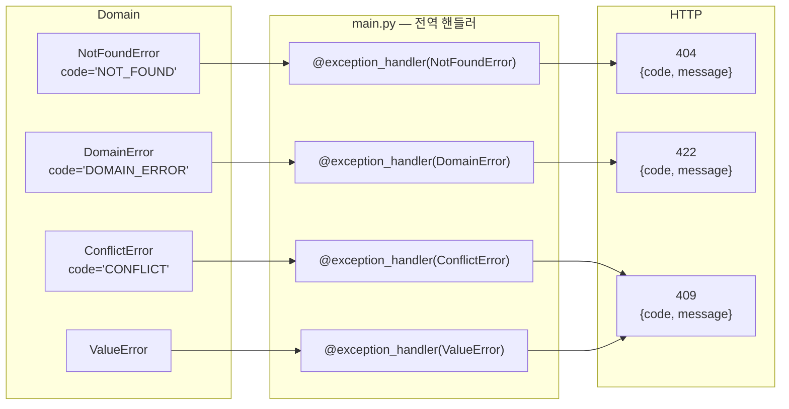

# AgentGate — Architecture Deep Dive

## 개요

AgentGate는 AI Agent의 모든 도구 호출을 인터셉트해
**정책 평가 → 실행/승인/차단 → 감사 기록** 파이프라인을 강제하는 백엔드 게이트웨이입니다.

Governance 확장 후에는 단순 Tool 실행 제어를 넘어 **Agent 단위 정책, 비용·토큰 예산, 도구 선택 추적, 정책 평가 trace, 설정 변경 이력**까지 동일한 도메인 경계 안에서 다룹니다 — "AI Agent Tool Governance Platform".

**설계 원칙**
- **DDD (Domain-Driven Design)**: 비즈니스 불변식을 Aggregate 경계 안에 캡슐화
- **Hexagonal Architecture (Ports & Adapters)**: 도메인은 인터페이스(ABC)만 알고, 구현체는 주입
- **Clean Architecture 의존 방향**: `api → application → domain ← infrastructure`

---

## 레이어 구조



---

## 도메인 모델 전체 구조


---

## InvokeToolUseCase 오케스트레이션 흐름



---

## ToolCall 상태 머신



**상태 조합 요약**

| policy_decision | execution_status | approval_status |
|-----------------|------------------|-----------------|
| DENY | SKIPPED | _(없음)_ |
| REQUIRE_APPROVAL | _(없음)_ | PENDING |
| REQUIRE_APPROVAL | _(없음)_ | REJECTED |
| REQUIRE_APPROVAL | SIMULATED / SUCCESS | EXECUTED |
| REQUIRE_APPROVAL | FAILED | FAILED |
| ALLOW | SIMULATED / SUCCESS / FAILED | _(없음)_ |

---

## Policy Engine — Rule Chain 상세

12개 룰을 순서대로 평가하며, 첫 번째로 단락하는 룰이 결정을 확정합니다. 각 룰의 평가 결과(PASS / DENY / REQUIRE_APPROVAL + 사유)는 `RuleEvaluation`으로 수집되어 ToolCall에 `rule_trace` JSON으로 영구 저장됩니다.



**룰 분류**

| 분류 | 룰 | 결정 |
|------|----|------|
| Entity 활성화 | ToolEnabledRule · UserEnabledRule · AgentEnabledRule | DENY |
| Agent 권한 | AgentToolPolicyRule (Allow/Deny) · RoleCheckRule · DomainAccessRule | DENY |
| Tool 비용 | CostLimitRule (하드) | DENY |
| Tool 비용 | ToolCostWarnRule (소프트) | REQUIRE_APPROVAL |
| Agent 예산 | AgentBudgetHardRule · AgentTokenLimitRule | DENY |
| Agent 예산 | AgentBudgetWarnRule | REQUIRE_APPROVAL |
| Risk 기반 | ApprovalRequiredRule | REQUIRE_APPROVAL |

**확장 방법**:
```python
# 새 룰 추가 (엔진·기존 룰 수정 없음)
class RateLimitRule(PolicyRule):
    def evaluate(self, ctx: PolicyContext) -> Optional[PolicyResult]:
        if self._is_rate_limited(ctx.agent.agent_id):
            return PolicyResult(PolicyDecision.DENY, "Rate limit exceeded")
        return None

DEFAULT_RULES.append(RateLimitRule())

# 테스트에서 단일 룰 격리
engine = PolicyEngine(rules=[RoleCheckRule()])
```

---

## 도메인 이벤트 흐름



---

## Repository Pattern (Port / Adapter)



**`save()`가 두 테이블을 원자적으로 upsert하는 이유**:
애그리게이트가 일관성의 단위이므로, `tool_calls` 행과 `approvals` 행은 단일 트랜잭션으로 함께 저장합니다. 호출자가 ORM 객체를 직접 조작하는 경로를 원천 차단합니다.

---

## 에러 처리 아키텍처



라우터 파일에는 `try/except`가 없습니다. 예외 → HTTP 매핑은 단 한 곳에서 관리.

---

## 주요 설계 결정 및 근거

### 1. Approval을 독립 Aggregate로 분리하지 않은 이유

`ToolCall`은 생애주기 동안 최대 하나의 `Approval`을 가집니다.
이 관계를 분리하면:
- "PENDING 상태가 아닌 ToolCall을 승인 불가" 불변식을 크로스-애그리게이트 트랜잭션으로 보장해야 함
- 트랜잭션 실패 시 보상 로직(saga) 필요

내부 Entity로 유지하면:
```python
def approve(self, approver_id: str) -> None:
    self._assert_approval_is(ApprovalStatus.PENDING)  # 불변식 보장
    self._approval.status = ApprovalStatus.APPROVED
```

### 2. Approval.status를 EXECUTED/FAILED로 진행시키는 이유

실행 완료 후 `APPROVED` 상태를 유지하면 "승인됐지만 실행됐나?"가 불명확합니다.
`EXECUTED`/`FAILED`로 진행하면:
- 감사 쿼리가 단순해짐 (`approval_status = 'EXECUTED'` 한 조건)
- 실행 실패를 승인 이력에서 추적 가능

### 3. trace_id 처리 우선순위를 body > header > auto-generate로 설정한 이유

```
1순위: body.trace_id    — 에이전트가 의도적으로 지정
2순위: X-Trace-Id 헤더 — 인프라/게이트웨이 레이어 삽입
3순위: UUID 자동 생성  — 추적 ID 없는 레거시 클라이언트 대응
```

모든 호출에 trace_id가 보장되어, 로그 집계 시 `trace_id`로 전체 흐름을 추적 가능합니다.

### 4. N+1 쿼리 방지

```python
# orm_models.py
approval = relationship(
    "ApprovalORM",
    back_populates="tool_call",
    uselist=False,
    lazy="selectin",   # ← N+1 방지
)
```

`find_all()` 호출 시 SQLAlchemy가 `SELECT ... WHERE id IN (...)` 단일 쿼리로 모든 approval을 로드합니다.

---

## 파일 구조 참조

```
app/
├── domain/
│   ├── enums.py                    RiskLevel · PolicyDecision · ApprovalStatus · ExecutionStatus
│   │                               AgentToolPolicyType · GovernanceEntityType · ChangeType · RuleOutcome
│   ├── shared/
│   │   ├── exceptions.py           AgentGateError 계층 (code 속성)
│   │   └── value_objects.py        InputData · ExecutionResult(duration_ms, tokens_used)
│   │                               ToolSelection · CandidateTool
│   ├── tool/
│   │   ├── tool.py                 Tool 애그리게이트 (requires_approval() · warn_cost_threshold)
│   │   └── repository.py           IToolRepository (ABC)
│   ├── agent/
│   │   ├── agent.py                Agent 애그리게이트 + 예산 필드 (daily/monthly cost, token, warn)
│   │   └── repository.py           IAgentRepository (ABC, update 포함)
│   ├── user/
│   │   ├── user.py                 User 애그리게이트 (has_role())
│   │   └── repository.py           IUserRepository (ABC)
│   ├── tool_call/
│   │   ├── tool_call.py            ToolCall Aggregate Root + Approval Entity
│   │   │                           + tool_selection · rule_trace · tokens_used
│   │   ├── events.py               도메인 이벤트 6종 (frozen dataclass)
│   │   ├── repository.py           IToolCallRepository (ABC, agent 단위 집계 포함)
│   │   └── executor.py             IToolExecutor (ABC)
│   ├── policy/
│   │   ├── context.py              PolicyContext (agent 예산·정책 포함) · PolicyResult
│   │   ├── rules.py                PolicyRule(ABC) + 12 concrete rules + DEFAULT_RULES
│   │   ├── policy_engine.py        PolicyEngine — rule chain + trace 수집
│   │   └── trace.py                RuleEvaluation 값 객체 + JSON 직렬화 헬퍼
│   ├── agent_tool_policy/
│   │   ├── agent_tool_policy.py    AgentToolPolicy aggregate
│   │   │                           + evaluate_agent_tool_policies (DENY > ALLOW)
│   │   └── repository.py           IAgentToolPolicyRepository (ABC)
│   └── governance/
│       ├── change_log.py           ConfigChangeLog aggregate (append-only)
│       └── repository.py           IConfigChangeLogRepository (ABC)
│
├── application/
│   ├── tool/use_cases.py           Register · Get · List · Update · Delete + change-log 발생
│   ├── gateway/use_cases.py        InvokeToolUseCase · ExecuteApprovedUseCase
│   │                               + selected_reason · candidates · agent 예산 컨텍스트
│   ├── approval/use_cases.py       List · Get · Approve · Reject
│   ├── agent_tool_policy/
│   │   └── use_cases.py            Create · List · Get · Update · Delete + change-log 발생
│   └── governance/
│       └── use_cases.py            ListChangeLogsUseCase (페이지네이션)
│
├── infrastructure/
│   ├── persistence/
│   │   ├── database.py             SQLAlchemy 엔진 (SQLite/PostgreSQL 이중 호환)
│   │   ├── orm_models.py           ORM 정의 (governance 컬럼 + 신규 테이블)
│   │   └── repositories/           구체 리포지토리 (agent_tool_policy · change_log 포함)
│   └── execution/
│       └── mock_executor.py        MockExecutor (wall-clock timing 포함)
│
└── api/
    ├── deps.py                     FastAPI 의존성 배선
    ├── schemas.py                  Pydantic 스키마 (governance DTO 포함)
    └── v1/
        ├── gateway.py              /invoke · /execute — selection · rule_trace 노출
        ├── tools.py                /tools CRUD — X-Acting-User · X-Change-Reason 헤더
        ├── approvals.py            /approvals
        ├── audit_logs.py           /audit-logs 페이지네이션 + 신규 필드 노출
        ├── agents.py               /agents CRUD + /agents/{id}/usage
        ├── users.py
        ├── agent_tool_policies.py  /agent-tool-policies CRUD
        └── governance.py           /governance/change-logs 페이지네이션 조회

alembic/versions/
├── 0001_initial_schema.py
├── 0002_add_performance_indices.py  복합 인덱스 (tool_name+created_at) · approval FK
├── 0003_audit_enrichment.py         trace_id(INDEX) · policy_reason · duration_ms
└── 0004_governance_expansion.py     warn_cost_threshold · agent 예산 · tokens_used
                                     rule_trace · selected_reason · candidate_tools
                                     agent_tool_policies · config_change_logs

tests/                               154 tests, 0 failures (coverage 95%)
├── test_tool_call_aggregate.py      18 — 상태 머신 전환 경로
├── test_value_objects.py            12 — 해싱 · 불변성
├── test_policy.py                    9 — PolicyEngine 전체 흐름
├── test_policy_rules.py             22 — 룰 격리 + 커스텀 체인
├── test_domain_events.py             8 — 이벤트 발행 순서/내용
├── test_audit_enrichment.py         21 — trace_id · pagination · 에러 포맷
├── test_gateway.py                  10 — HTTP 통합 테스트
├── test_approvals.py                 6 — 승인 플로우
├── test_tools.py                     7 — Tool Registry
├── test_agent_tool_policy.py        15 — DENY > ALLOW + CRUD + e2e
├── test_agent_budget.py             13 — 룰 격리 + warn band + /usage
├── test_decision_tracking.py         6 — selected_reason · candidates · rule_trace
└── test_change_log.py                8 — Tool / Policy 변경 감사
```
