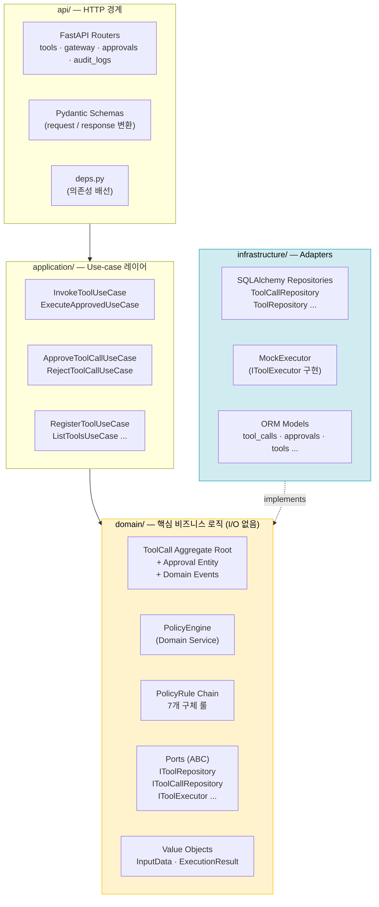
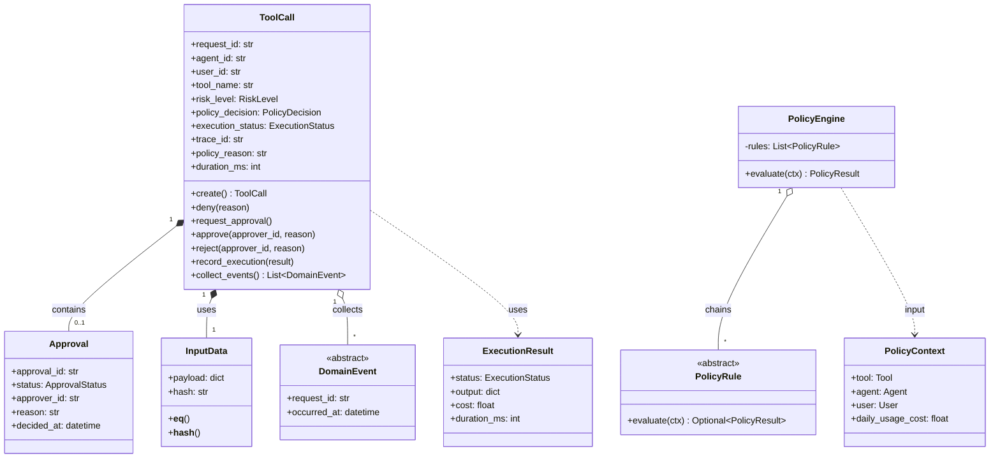
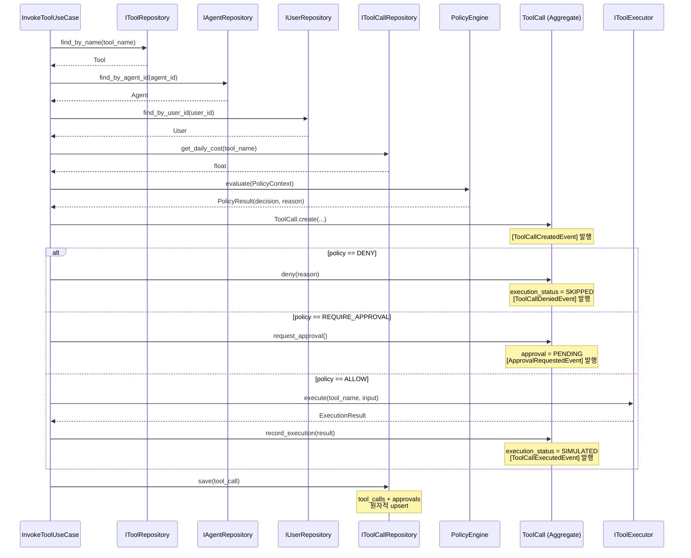
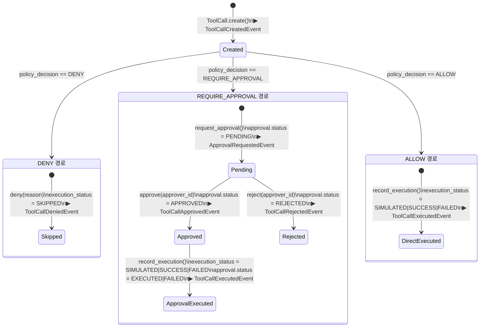
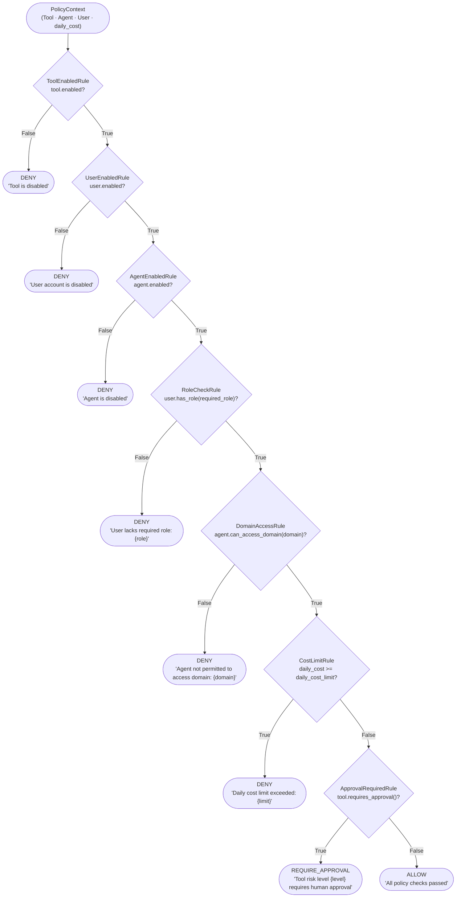
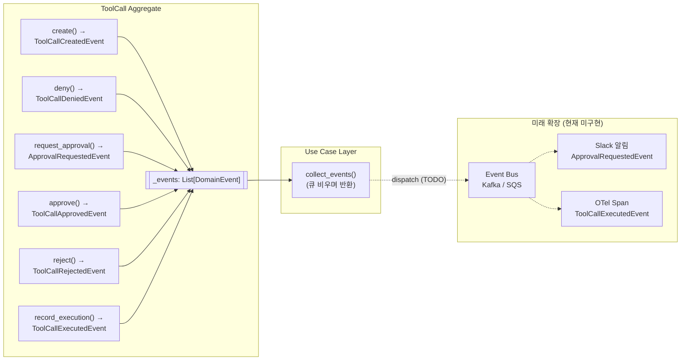
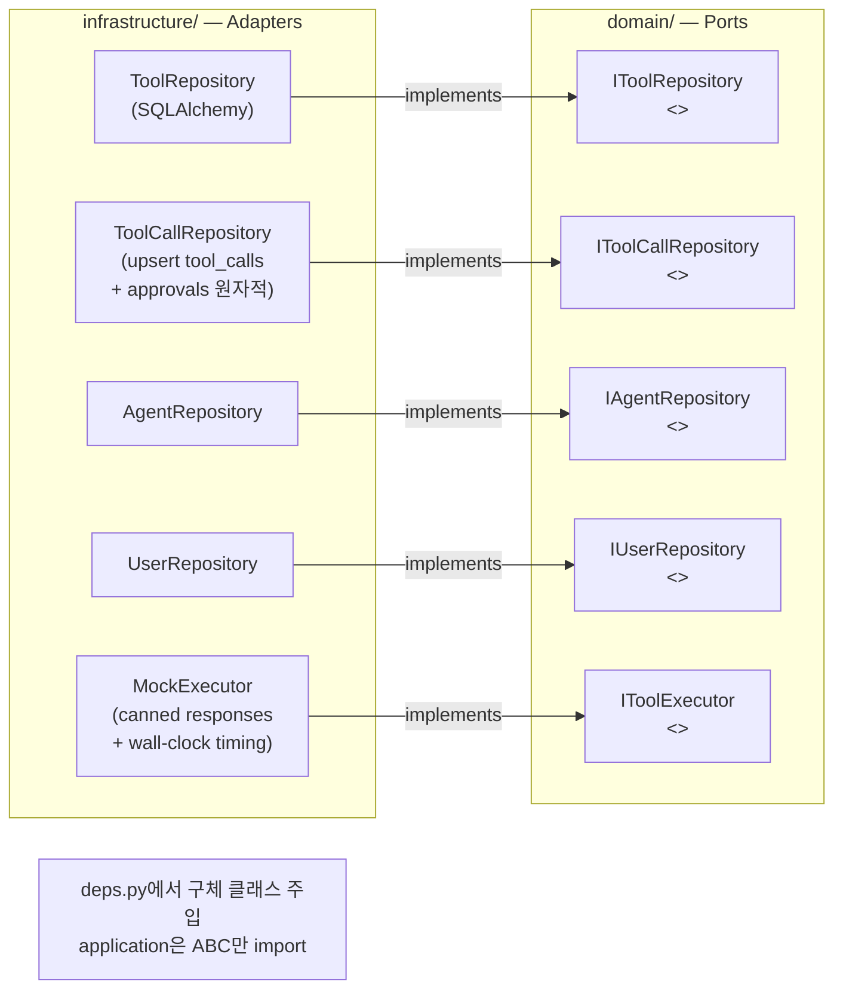
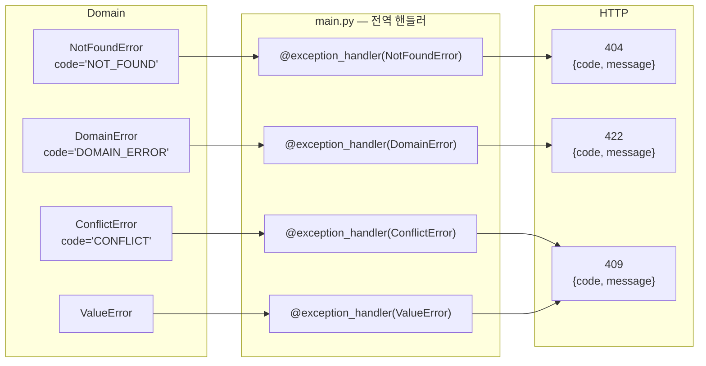

# AgentGate — Architecture Deep Dive

## 개요

AgentGate는 AI Agent의 모든 도구 호출을 인터셉트해
**정책 평가 → 실행/승인/차단 → 감사 기록** 파이프라인을 강제하는 백엔드 게이트웨이입니다.

**설계 원칙**
- **DDD (Domain-Driven Design)**: 비즈니스 불변식을 Aggregate 경계 안에 캡슐화
- **Hexagonal Architecture (Ports & Adapters)**: 도메인은 인터페이스(ABC)만 알고, 구현체는 주입
- **Clean Architecture 의존 방향**: `api → application → domain ← infrastructure`

---

## 레이어 구조



---

## 도메인 모델 전체 구조



---

## InvokeToolUseCase 오케스트레이션 흐름



---

## ToolCall 상태 머신



**상태 조합 요약**

| policy_decision | execution_status | approval_status |
|-----------------|------------------|-----------------|
| DENY | SKIPPED | _(없음)_ |
| REQUIRE_APPROVAL | _(없음)_ | PENDING |
| REQUIRE_APPROVAL | _(없음)_ | REJECTED |
| REQUIRE_APPROVAL | SIMULATED / SUCCESS | EXECUTED |
| REQUIRE_APPROVAL | FAILED | FAILED |
| ALLOW | SIMULATED / SUCCESS / FAILED | _(없음)_ |

---

## Policy Engine — Rule Chain 상세



**확장 방법**:
```python
# 새 룰 추가 (엔진·기존 룰 수정 없음)
class RateLimitRule(PolicyRule):
    def evaluate(self, ctx: PolicyContext) -> Optional[PolicyResult]:
        if self._is_rate_limited(ctx.agent.agent_id):
            return PolicyResult(PolicyDecision.DENY, "Rate limit exceeded")
        return None

DEFAULT_RULES.append(RateLimitRule())

# 테스트에서 단일 룰 격리
engine = PolicyEngine(rules=[RoleCheckRule()])
```

---

## 도메인 이벤트 흐름



---

## Repository Pattern (Port / Adapter)



**`save()`가 두 테이블을 원자적으로 upsert하는 이유**:
애그리게이트가 일관성의 단위이므로, `tool_calls` 행과 `approvals` 행은 단일 트랜잭션으로 함께 저장합니다. 호출자가 ORM 객체를 직접 조작하는 경로를 원천 차단합니다.

---

## 에러 처리 아키텍처



라우터 파일에는 `try/except`가 없습니다. 예외 → HTTP 매핑은 단 한 곳에서 관리.

---

## 주요 설계 결정 및 근거

### 1. Approval을 독립 Aggregate로 분리하지 않은 이유

`ToolCall`은 생애주기 동안 최대 하나의 `Approval`을 가집니다.
이 관계를 분리하면:
- "PENDING 상태가 아닌 ToolCall을 승인 불가" 불변식을 크로스-애그리게이트 트랜잭션으로 보장해야 함
- 트랜잭션 실패 시 보상 로직(saga) 필요

내부 Entity로 유지하면:
```python
def approve(self, approver_id: str) -> None:
    self._assert_approval_is(ApprovalStatus.PENDING)  # 불변식 보장
    self._approval.status = ApprovalStatus.APPROVED
```

### 2. Approval.status를 EXECUTED/FAILED로 진행시키는 이유

실행 완료 후 `APPROVED` 상태를 유지하면 "승인됐지만 실행됐나?"가 불명확합니다.
`EXECUTED`/`FAILED`로 진행하면:
- 감사 쿼리가 단순해짐 (`approval_status = 'EXECUTED'` 한 조건)
- 실행 실패를 승인 이력에서 추적 가능

### 3. trace_id 처리 우선순위를 body > header > auto-generate로 설정한 이유

```
1순위: body.trace_id    — 에이전트가 의도적으로 지정
2순위: X-Trace-Id 헤더 — 인프라/게이트웨이 레이어 삽입
3순위: UUID 자동 생성  — 추적 ID 없는 레거시 클라이언트 대응
```

모든 호출에 trace_id가 보장되어, 로그 집계 시 `trace_id`로 전체 흐름을 추적 가능합니다.

### 4. N+1 쿼리 방지

```python
# orm_models.py
approval = relationship(
    "ApprovalORM",
    back_populates="tool_call",
    uselist=False,
    lazy="selectin",   # ← N+1 방지
)
```

`find_all()` 호출 시 SQLAlchemy가 `SELECT ... WHERE id IN (...)` 단일 쿼리로 모든 approval을 로드합니다.

---

## 파일 구조 참조

```
app/
├── domain/
│   ├── enums.py                    RiskLevel · PolicyDecision · ApprovalStatus · ExecutionStatus
│   ├── shared/
│   │   ├── exceptions.py           AgentGateError 계층 (code 속성)
│   │   └── value_objects.py        InputData(SHA-256 해시) · ExecutionResult(duration_ms)
│   ├── tool/
│   │   ├── tool.py                 Tool 애그리게이트 (requires_approval())
│   │   └── repository.py           IToolRepository (ABC)
│   ├── agent/
│   │   ├── agent.py                Agent 애그리게이트 (can_access_domain())
│   │   └── repository.py           IAgentRepository (ABC)
│   ├── user/
│   │   ├── user.py                 User 애그리게이트 (has_role())
│   │   └── repository.py           IUserRepository (ABC)
│   ├── tool_call/
│   │   ├── tool_call.py            ToolCall Aggregate Root + Approval Entity
│   │   ├── events.py               도메인 이벤트 6종 (frozen dataclass)
│   │   ├── repository.py           IToolCallRepository (ABC)
│   │   └── executor.py             IToolExecutor (ABC)
│   └── policy/
│       ├── context.py              PolicyContext · PolicyResult
│       ├── rules.py                PolicyRule(ABC) + 7 concrete rules + DEFAULT_RULES
│       └── policy_engine.py        PolicyEngine — rule chain 순회
│
├── application/
│   ├── tool/use_cases.py           Register · Get · List · Update · Delete
│   ├── gateway/use_cases.py        InvokeToolUseCase · ExecuteApprovedUseCase
│   └── approval/use_cases.py       List · Get · Approve · Reject
│
├── infrastructure/
│   ├── persistence/
│   │   ├── database.py             SQLAlchemy 엔진 (SQLite/PostgreSQL 이중 호환)
│   │   ├── orm_models.py           ORM 정의 (trace_id · policy_reason · duration_ms)
│   │   └── repositories/           구체 리포지토리 구현체
│   └── execution/
│       └── mock_executor.py        MockExecutor (wall-clock timing 포함)
│
└── api/
    ├── deps.py                     FastAPI 의존성 배선
    ├── schemas.py                  Pydantic (ErrorCode · ErrorResponse · AuditLogPage)
    └── v1/
        ├── gateway.py              /invoke · /execute — try/except 없음
        ├── tools.py                /tools CRUD — try/except 없음
        ├── approvals.py            /approvals — try/except 없음
        ├── audit_logs.py           /audit-logs 페이지네이션 — try/except 없음
        ├── agents.py
        └── users.py

alembic/versions/
├── 0001_initial_schema.py
├── 0002_add_performance_indices.py  복합 인덱스 (tool_name+created_at) · approval FK
└── 0003_audit_enrichment.py         trace_id(INDEX) · policy_reason · duration_ms

tests/                               112 tests, 0 failures
├── test_tool_call_aggregate.py      18 — 상태 머신 전환 경로
├── test_value_objects.py            12 — 해싱 · 불변성
├── test_policy.py                   9  — PolicyEngine 전체 흐름
├── test_policy_rules.py             22 — 룰 격리 + 커스텀 체인
├── test_domain_events.py            8  — 이벤트 발행 순서/내용
├── test_audit_enrichment.py         21 — trace_id · pagination · 에러 포맷
├── test_gateway.py                  10 — HTTP 통합 테스트
├── test_approvals.py                6  — 승인 플로우
└── test_tools.py                    7  — Tool Registry
```
