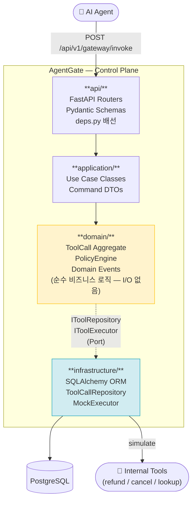
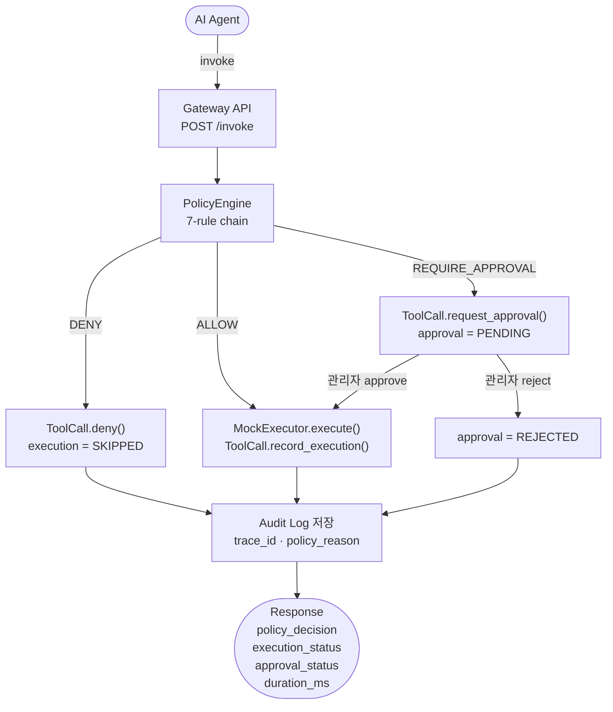
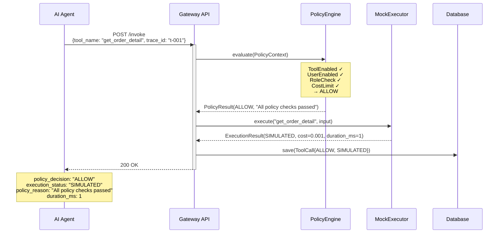
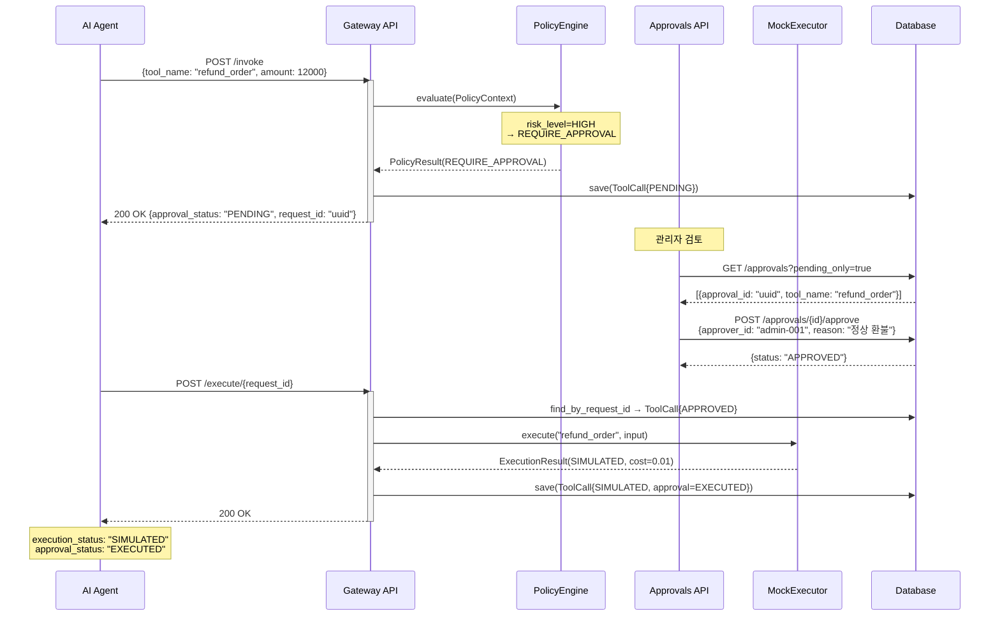
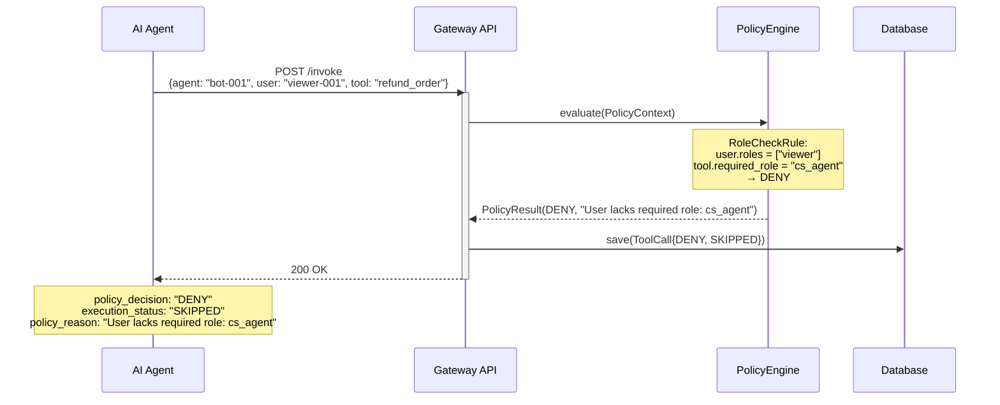
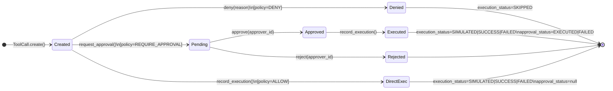
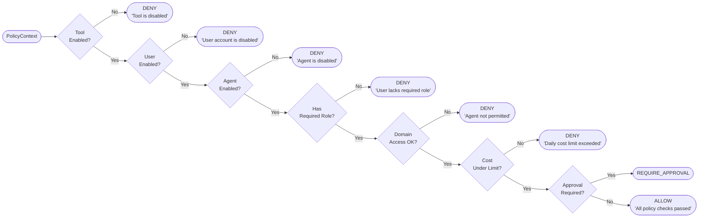

# AgentGate

**AI Agent가 내부 시스템을 안전하게 호출하도록 권한·승인·비용·감사를 통제하는 AI Agent Gateway 플랫폼**

[](https://www.python.org)
[](https://fastapi.tiangolo.com)
[](#테스트)
[](ARCHITECTURE.md)

---

## What is AgentGate?

AI Agent는 환불 처리, 주문 취소, 고객 데이터 조회 같은 **내부 도구를 자율적으로 호출**합니다.
이 호출들은 되돌리기 어렵고, 비용이 발생하며, 보안 경계를 넘습니다.

AgentGate는 에이전트와 도구 사이에 위치하는 **Control Plane**입니다:

> _"모든 도구 호출은 AgentGate를 통과해야 한다. 통과하려면 정책을 만족해야 하고, 고위험 작업은 사람의 승인을 받아야 한다."_

단순한 AI 앱이 아닙니다. **Agent Observability · Policy Enforcement · Human-in-the-Loop**를 조합한 게이트웨이 플랫폼입니다.

---

## 핵심 문제와 해결

| 문제 | AgentGate 해결 방법 |
|------|-------------------|
| 권한 없는 에이전트가 민감 API 호출 | Tool·Agent·User 3중 정책 검사 (역할, 도메인 접근) |
| 고위험 작업(환불·취소)의 즉시 실행 | REQUIRE_APPROVAL → 인간 승인 후 실행 |
| API 비용 무제한 누적 | 도구별 일일 비용 한도 (daily_cost_limit) |
| 사고 후 원인 파악 불가 | trace_id · policy_reason · duration_ms 감사 로그 |
| 정책 변경 시 코드 수정 범위 과다 | PolicyRule 체인 — 룰 하나 추가로 정책 확장 |

---

## 기능 매트릭스

| 기능 | 상세 |
|------|------|
| **Tool Registry** | 도구 등록, 위험도(LOW/MEDIUM/HIGH), 역할 요구사항, 일일 비용 한도(`daily_cost_limit`) + 소프트 한도(`warn_cost_threshold`), 활성화 토글 |
| **Policy Engine** | Chain of Responsibility — 12개 룰 순서 평가, 첫 매칭 단락. 새 룰 추가 시 기존 코드 무변경. 평가 trace를 호출별로 보관 |
| **Agent Tool Policy** | Agent별 Allowlist/Denylist (DENY > ALLOW 우선). 사유·작성자·활성여부 기록, 변경 시 자동 감사 |
| **Agent Budget** | Agent별 일일 비용/토큰 한도. 초과 → DENY, 워닝 임계치 도달 → REQUIRE_APPROVAL |
| **Decision Tracking** | Invoke 요청에 `selected_reason`과 `candidates`(미선택 후보의 사유) 첨부, ToolCall과 함께 영구 저장 |
| **Approval Flow** | HIGH 위험 / approval_required 도구는 관리자 승인 후 실행. PENDING → APPROVED → EXECUTED 상태 추적 |
| **Audit Log** | 모든 호출에 trace_id, policy_reason, rule_trace, duration_ms, tokens_used 기록. 페이지네이션 제공 |
| **Config Change Log** | Tool / AgentToolPolicy 변경마다 before·after JSON + actor·reason 기록 (`/governance/change-logs`) |
| **Domain Events** | 상태 전환마다 이벤트 발행 (ToolCallCreated, Approved, Executed…). 이벤트 버스 연결 확장점 |
| **표준 에러 응답** | `{"code": "NOT_FOUND", "message": "..."}` — 전역 핸들러 한 곳에서 관리 |
| **MockExecutor** | 실제 HTTP 없이 도구 실행 시뮬레이션. IToolExecutor 인터페이스로 실 구현체 교체 가능 |

---

## Governance 확장 API

| 메서드 | 경로 | 설명 |
|-------|------|------|
| POST/GET/PATCH/DELETE | `/api/v1/agent-tool-policies` | Agent별 Allow/Deny 엔트리 CRUD. DENY가 ALLOW를 항상 우선합니다 |
| GET | `/api/v1/agents/{agent_id}/usage` | 해당 Agent의 오늘/이번 달 비용·토큰 사용량과 한도 비교 |
| PATCH | `/api/v1/agents/{agent_id}` | Agent의 budget 필드(`daily_cost_limit` 등) 갱신 |
| GET | `/api/v1/governance/change-logs` | Tool / AgentToolPolicy 변경 이력 페이지네이션 조회 (`entity_type`, `entity_key` 필터 지원) |
| POST | `/api/v1/gateway/invoke` | `selected_reason`, `candidates[{tool_name, reason_not_selected}]` 옵션 필드 추가 |

`X-Acting-User`, `X-Change-Reason` 헤더를 같이 보내면 Tool / Policy 변경 시 감사 로그의 `changed_by` / `reason` 필드를 채울 수 있습니다.

---

## 시스템 아키텍처



**의존성 방향**: `api → application → domain ← infrastructure`
domain은 infrastructure를 절대 import하지 않습니다.

---

## 핵심 실행 흐름



---

## 시나리오별 Sequence Diagram

### 시나리오 1 — 저위험 도구: 즉시 실행



### 시나리오 2 — 고위험 도구: 승인 플로우



### 시나리오 3 — 정책 위반: 즉시 차단



---

## ToolCall 상태 머신



---

## Policy Engine — Rule Chain



---

## 빠른 시작

### Docker (권장)

```bash
make up
open http://localhost:8000/docs   # Swagger UI
make seed                          # 데모 데이터 삽입
```

### 로컬 개발

```bash
python3.11 -m venv .venv && source .venv/bin/activate
pip install -e ".[dev]"
docker compose up db -d
cp .env.example .env
alembic upgrade head
uvicorn app.main:app --reload
```

---

## API 사용 예시 (curl)

### 사전 준비 — 도구 / 에이전트 / 사용자 등록

```bash
# 고위험 도구 등록
curl -s -X POST http://localhost:8000/api/v1/tools \
  -H "Content-Type: application/json" \
  -d '{
    "tool_id": "tool-refund",
    "name": "refund_order",
    "description": "주문 환불 처리",
    "domain": "order",
    "risk_level": "HIGH",
    "required_role": "cs_agent",
    "approval_required": true,
    "sandbox_supported": true,
    "daily_cost_limit": 100.0
  }' | jq .

# 에이전트 등록 (order 도메인 접근 허용)
curl -s -X POST http://localhost:8000/api/v1/agents \
  -H "Content-Type: application/json" \
  -d '{
    "agent_id": "cs-agent-001",
    "name": "CS Agent",
    "allowed_domains": ["order"]
  }' | jq .

# 사용자 등록 (cs_agent 역할)
curl -s -X POST http://localhost:8000/api/v1/users \
  -H "Content-Type: application/json" \
  -d '{
    "user_id": "user-001",
    "roles": ["cs_agent"]
  }' | jq .
```

### Gateway — 도구 호출 (즉시 실행)

```bash
# 저위험 도구 호출 → 즉시 실행
curl -s -X POST http://localhost:8000/api/v1/gateway/invoke \
  -H "Content-Type: application/json" \
  -H "X-Trace-Id: trace-abc-001" \
  -d '{
    "agent_id": "cs-agent-001",
    "user_id": "user-001",
    "tool_name": "get_order_detail",
    "input": {"order_id": "ORDER-1234"}
  }' | jq '{
    policy_decision: .policy_decision,
    execution_status: .execution_status,
    policy_reason: .policy_reason,
    trace_id: .trace_id,
    duration_ms: .duration_ms
  }'

# 응답:
# {
#   "policy_decision": "ALLOW",
#   "execution_status": "SIMULATED",
#   "policy_reason": "All policy checks passed",
#   "trace_id": "trace-abc-001",
#   "duration_ms": 1
# }
```

### Gateway — 승인 플로우 (4단계)

```bash
# Step 1: 고위험 도구 호출 → PENDING
REQUEST_ID=$(curl -s -X POST http://localhost:8000/api/v1/gateway/invoke \
  -H "Content-Type: application/json" \
  -d '{
    "agent_id": "cs-agent-001",
    "user_id": "user-001",
    "tool_name": "refund_order",
    "input": {"order_id": "ORDER-1234", "amount": 12000, "reason": "고객 요청"}
  }' | jq -r '.request_id')

echo "request_id: $REQUEST_ID"

# Step 2: 승인 대기 목록 조회
APPROVAL_ID=$(curl -s "http://localhost:8000/api/v1/approvals?pending_only=true" \
  | jq -r '.[0].approval_id')

echo "approval_id: $APPROVAL_ID"

# Step 3: 관리자 승인
curl -s -X POST "http://localhost:8000/api/v1/approvals/$APPROVAL_ID/approve" \
  -H "Content-Type: application/json" \
  -d '{"approver_id": "admin-001", "reason": "정상 환불 요청 확인"}' \
  | jq '{status: .status, approver_id: .approver_id}'

# Step 4: 실행
curl -s -X POST "http://localhost:8000/api/v1/gateway/execute/$REQUEST_ID" \
  | jq '{
    execution_status: .execution_status,
    approval_status: .approval_status,
    actual_cost: .actual_cost,
    duration_ms: .duration_ms
  }'

# 최종 응답:
# {
#   "execution_status": "SIMULATED",
#   "approval_status": "EXECUTED",
#   "actual_cost": 0.01,
#   "duration_ms": 2
# }
```

### Gateway — 정책 위반 확인

```bash
# 역할 없는 사용자가 고위험 도구 호출
curl -s -X POST http://localhost:8000/api/v1/gateway/invoke \
  -H "Content-Type: application/json" \
  -d '{
    "agent_id": "cs-agent-001",
    "user_id": "viewer-001",
    "tool_name": "refund_order",
    "input": {}
  }' | jq '{
    policy_decision: .policy_decision,
    policy_reason: .policy_reason,
    execution_status: .execution_status
  }'

# 응답:
# {
#   "policy_decision": "DENY",
#   "policy_reason": "User lacks required role: cs_agent",
#   "execution_status": "SKIPPED"
# }
```

### Audit Log — 감사 로그 조회

```bash
# 전체 로그 (페이지네이션)
curl -s "http://localhost:8000/api/v1/audit-logs?limit=10&offset=0" | jq '{
  total: .total,
  has_next: .has_next,
  first_item: .items[0] | {
    tool_name, policy_decision, policy_reason, trace_id, duration_ms
  }
}'

# 특정 호출 단건 조회
curl -s "http://localhost:8000/api/v1/audit-logs/$REQUEST_ID" | jq .
```

### 에러 응답 형식

```bash
# 존재하지 않는 도구 호출
curl -s -X POST http://localhost:8000/api/v1/gateway/invoke \
  -d '{"agent_id":"a","user_id":"u","tool_name":"no_such_tool","input":{}}' \
  | jq .

# 응답:
# {
#   "code": "NOT_FOUND",
#   "message": "Tool not found: no_such_tool"
# }
```

---

## 기술적 의사결정 포인트

### 1. Policy Engine — Chain of Responsibility 패턴

**결정**: 7개 `PolicyRule` ABC 서브클래스를 순서대로 평가하는 체인 구조.

**대안 대비 이유**:
- **if-else 평탄화** → 룰 추가 시 엔진 수정 필요. OCP(Open/Closed Principle) 위반.
- **Strategy 패턴** → 단일 룰 교체에 적합하지만 복수 룰의 순서 제어가 어렵.
- **Chain of Responsibility** → 룰 하나가 `None` 반환 시 다음으로 위임. 새 룰 = 새 클래스 하나. 엔진 코드 무변경.

```python
# 새 정책 추가: 한 줄
DEFAULT_RULES = [*DEFAULT_RULES, RateLimitRule()]
# 테스트에서 격리: 주입 가능
engine = PolicyEngine(rules=[RoleCheckRule()])
```

### 2. ToolCall — Aggregate Root + 내부 Entity

**결정**: `Approval`을 독립 애그리게이트가 아닌 `ToolCall` 내부 Entity로 설계.

**이유**: ToolCall과 Approval은 생명주기가 결합되어 있고, "PENDING 상태가 아닌 호출을 승인 불가" 같은 불변식은 경계 내부에서만 안전하게 보장됩니다. 별도 애그리게이트라면 크로스-애그리게이트 트랜잭션이 필요합니다.

```
결과: tool_call.approve()가 invariant 보장
      repository.save()가 두 테이블을 원자적으로 upsert
```

### 3. 도메인 이벤트 — Collect & Dispatch

**결정**: 애그리게이트가 이벤트를 내부 큐에 수집, 외부에서 `collect_events()`로 가져가는 방식.

**이유**: 이벤트 발행을 인프라(Kafka, Slack)와 분리합니다. 애그리게이트 수정 없이 이벤트 처리 로직을 추가·제거할 수 있습니다. 도메인 레이어는 발행 방법을 모릅니다.

### 4. 글로벌 예외 핸들러

**결정**: 모든 라우터에서 `try/except` 제거, `main.py` 한 곳에서 도메인 예외 → HTTP 매핑.

**이유**: 이전 구조에서는 5개 라우터가 각자 `NotFoundError → 404`를 처리했습니다. 매핑 규칙이 분산되어 일관성이 깨질 수 있고, 새 예외 추가 시 모든 라우터를 수정해야 했습니다.

### 5. SQLite/PostgreSQL 이중 호환

**결정**: 테스트는 SQLite 인메모리, 운영은 PostgreSQL. `database.py`에서 드라이버를 감지해 커넥션 풀 파라미터를 조건부 적용.

**이유**: CI/CD에서 외부 DB 컨테이너 없이 112개 테스트를 0.96초에 실행. PostgreSQL만 지원하면 로컬 개발 환경 의존성이 증가합니다.

---

## MVP에서 의도적으로 제외한 범위

이 프로젝트는 **제어 플레인 아키텍처 검증**이 목표입니다. 아래 항목은 확장 포인트를 정의한 채로 MVP 범위에서 제외했습니다.

| 항목 | 제외 이유 | 확장 포인트 |
|------|----------|------------|
| **JWT / API Key 인증** | 정책·승인 로직 집중. 인증은 미들웨어 레이어 문제 | `app/main.py` 미들웨어 + `deps.py` Depends |
| **실제 HTTP 도구 실행** | MockExecutor로 인터페이스 검증. 실행 로직 교체 가능 | `IToolExecutor` 구현체 교체 |
| **LangGraph / OpenAI 에이전트 연동** | 게이트웨이 자체가 독립 서비스여야 함 | `/mcp` 또는 `/agent` 라우터 추가 |
| **실시간 승인 알림** | 이벤트 구조 완성 후 자연스럽게 추가 가능 | `ApprovalRequestedEvent` 구독 |
| **비동기 처리 (async/await)** | 동기 SQLAlchemy로 설계 검증 우선 | `AsyncSession` 교체 |
| **멀티테넌시** | 단일 테넌트로 도메인 모델 단순화 | Agent·User에 `tenant_id` 추가 |
| **OpenTelemetry** | trace_id 필드를 미리 확보해둠 | `trace_id`를 OTel span context로 전파 |
| **Rate Limiting** | PolicyRule 체인으로 추가 가능 | `RateLimitRule` 클래스 추가 |

---

## 테스트

```bash
make test                                       # Docker 컨테이너 내부 실행
pytest --cov=app --cov-report=term-missing      # 커버리지 포함
```

| 파일 | 커버 범위 | 테스트 수 |
|------|-----------|-----------|
| `test_tool_call_aggregate.py` | ToolCall 상태 머신 전환 경로 전체 | 18 |
| `test_value_objects.py` | InputData 해싱, ExecutionResult 불변성 | 12 |
| `test_policy.py` | PolicyEngine 전체 결정 흐름 | 9 |
| `test_policy_rules.py` | 각 룰 격리 테스트 + 커스텀 체인 주입 | 22 |
| `test_domain_events.py` | 상태 전환마다 이벤트 발행 검증 | 8 |
| `test_audit_enrichment.py` | trace_id · policy_reason · pagination · 에러 포맷 | 21 |
| `test_gateway.py` | HTTP 통합 — ALLOW/DENY/승인 플로우 전체 | 10 |
| `test_approvals.py` | 승인 CRUD + 이중 승인 가드 | 6 |
| `test_tools.py` | Tool Registry CRUD | 7 |

**112 tests, 0 failures** — SQLite 인메모리, 외부 DB 불필요.

---

## ERD

```
tools                              agents                          users
─────────────────────              ───────────────────────────     ────────────────
tool_id (UK, INDEX)                agent_id (UK, INDEX)            user_id (UK, INDEX)
name                               name                            roles (JSON)
description                        allowed_domains (JSON)          enabled
domain                             enabled                         created_at
risk_level                         daily_cost_limit
required_role                      monthly_cost_limit
approval_required                  daily_token_limit
sandbox_supported                  daily_cost_warn_threshold
daily_cost_limit                   created_at
warn_cost_threshold
enabled
created_at · updated_at

tool_calls (핵심 감사 테이블)
─────────────────────────────────────────────────────────────────────────
request_id (UK, INDEX)     trace_id (INDEX)           policy_reason
agent_id (INDEX) ──┐       duration_ms                rule_trace (JSON)
user_id (INDEX)    │       risk_level                 selected_reason
tool_name ──┐      │       policy_decision    ALLOW | REQUIRE_APPROVAL | DENY
input_data  │ (INDEX)      approval_status    PENDING|APPROVED|REJECTED|EXECUTED|FAILED
input_hash  ┘      │       execution_status   SIMULATED|SUCCESS|FAILED|SKIPPED
estimated_cost     │       actual_cost · tokens_used
candidate_tools (JSON)
created_at (INDEX) ──┴── 복합 인덱스 (tool_name+created_at) · (agent_id+created_at)
executed_at

approvals
─────────────────────────────────────
id (PK)
tool_call_id → tool_calls.id (INDEX)
approver_id · status · reason
created_at · updated_at

agent_tool_policies (Allow/Deny per agent)
─────────────────────────────────────────────────────────────────────────
id (PK)
agent_id (INDEX)
tool_name
policy_type        ALLOW | DENY               ── UNIQUE (agent_id, tool_name, policy_type)
enabled            INDEX (agent_id, enabled)
reason · created_by
created_at · updated_at

config_change_logs (append-only governance journal)
─────────────────────────────────────────────────────────────────────────
id (PK)
entity_type   TOOL | AGENT | USER | AGENT_TOOL_POLICY    (INDEX)
entity_key                                                (INDEX)
change_type   CREATE | UPDATE | DELETE
before (JSON) · after (JSON)
reason · changed_by
changed_at    (INDEX)
```

---

## 향후 확장 방향

### 단기 (기능 완성)

```
IToolExecutor 실 구현체
    └─ HTTP 기반 도구 호출 (timeout, retry, circuit breaker)

JWT 미들웨어
    └─ API Key 또는 Bearer 토큰 검증
    └─ Agent · User 자동 resolve

Slack / Email 알림
    └─ ApprovalRequestedEvent 구독
    └─ 승인 대기 시 관리자 알림
```

### 중기 (플랫폼화)

```
LangGraph Agent 연동
    └─ AgentGate를 Tool Server로 등록
    └─ /mcp (Model Context Protocol) 엔드포인트

OpenTelemetry
    └─ trace_id → W3C Trace Context 전파
    └─ PolicyEngine 평가 시간 메트릭

이벤트 버스 연결
    └─ collect_events() → Kafka / SQS 발행
    └─ CQRS 읽기 모델 분리
```

### 장기 (엔터프라이즈)

```
멀티테넌시
    └─ tenant_id 격리 (행 수준 보안)

비동기 전환
    └─ AsyncSession + async def 라우터
    └─ 동시 처리량 대폭 향상

분산 추적
    └─ Jaeger / Tempo 연동
    └─ Agent → AgentGate → Tool 전체 span
```

---

## Make 커맨드

```bash
make up       # 서버 기동 (DB 포함, 포그라운드)
make up-d     # 백그라운드 기동
make down     # 종료 + 볼륨 삭제
make test     # 테스트 실행 (컨테이너 내부)
make seed     # 데모 데이터 삽입
make migrate  # DB 마이그레이션
make shell    # api 컨테이너 셸 진입
make logs     # 로그 스트리밍
```

자세한 아키텍처 설명은 [ARCHITECTURE.md](ARCHITECTURE.md) 참고.
